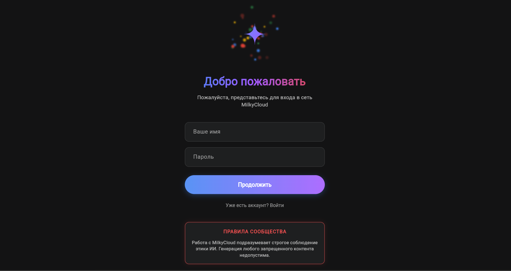
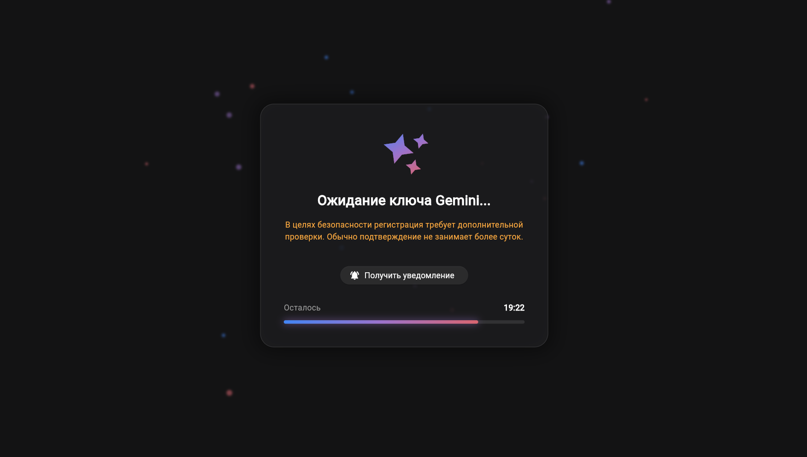
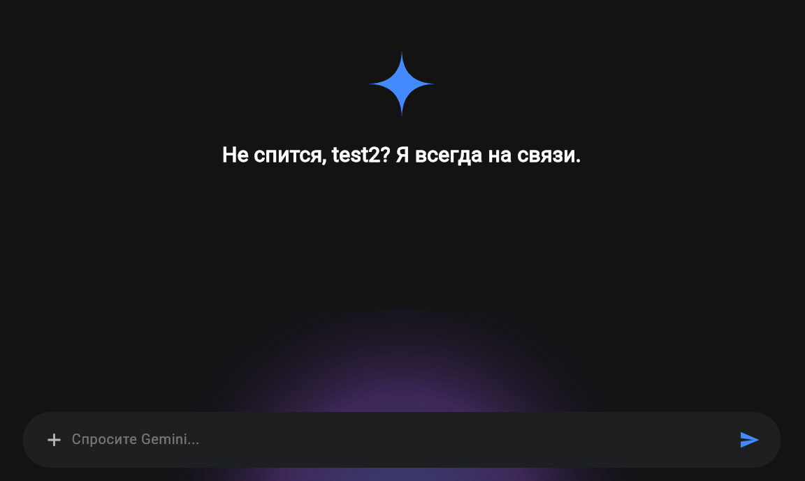

<div align="center">
  
  <h1>Gemini Bridge</h1>
</div>

Language: [Русский](#russian) | [English](#english)

---

<a name="russian"></a>
## Русский

Gemini Bridge - это полнофункциональный прокси-сервер и веб-интерфейс, предназначенный для обеспечения бесперебойного и безопасного доступа к Gemini AI API от Google из регионов с ограничениями. Он включает масштабируемый бэкенд на FastAPI с надежной системой уведомлений в Telegram и современный адаптивный веб-клиент на Flutter. Также в комплекте идет панель администратора для управления пользователями и просмотра истории.

### Демонстрация






### Особенности
* Безопасный контроль доступа: Для регистрации требуется App Secret и Hardware ID. Для последующих вызовов API выдаются безопасные серверные токены.
* Уведомления в Telegram: Администраторы получают уведомления в Telegram, когда новый пользователь регистрируется или запрашивает токен.
* Назначение пользовательских токенов: Пользователи помещаются в очередь ожидания, пока администратор не назначит им ключ API Gemini.
* Современный UI: Веб-клиент, созданный на Flutter, имеет красивый интерфейс чата, эстетику темного режима и поддержку markdown.
* Загрузка файлов: Поддерживает загрузку изображений и файлов для мультимодальной обработки Gemini.
* Панель администратора: Удобное приложение на Python для выгрузки историй чатов и выдачи ключей пользователям.
* Docker: Полностью контейнеризован с использованием Docker и Nginx для простого развертывания.

### Быстрый старт

1. Клонируйте репозиторий:
   ```bash
   git clone https://github.com/milkycloud-dev/gemini-bridge.git
   cd gemini-bridge
   ```

2. Настройте секреты:
   Запустите установочный скрипт для настройки токенов и секретов.
   ```bash
   python setup.py
   ```
   Вас попросят ввести токен бота Telegram, ID чата, IP или домен сервера и App Secret.

3. Запустите бэкенд:
   ```bash
   docker-compose up -d --build
   ```

4. Соберите веб-клиент:
   Убедитесь, что у вас установлен Flutter, затем выполните:
   ```bash
   cd web-client
   flutter build web --release
   ```
   Разверните папку `build/web` на вашем хостинге (например, GitHub Pages, Nginx).

5. Панель администратора:
   Перейдите в папку `admin_panel` и запустите `admin.bat` (для Windows) или `app.py`. Приложение скачает базу данных с вашего VPS и откроет интерфейс для модерации чатов.

---

<a name="english"></a>
## English

Gemini Bridge is a full-stack proxy and web interface designed to provide seamless, secure access to Google's Gemini AI API from restricted regions. It features a scalable FastAPI backend with a robust Telegram notification system, and a modern, responsive Flutter web client. It also includes an administrative panel to review chat histories and manage user access.


### Features
* Secure Access Control: Requires an App Secret and Hardware ID for registration, and dispenses secure Server Tokens for subsequent API calls.
* Telegram Notifications: Admins receive instant Telegram notifications when a new user registers or requests an access token.
* Custom Token Assignment: Users are placed in a waiting queue until an admin assigns them a dedicated Gemini API key.
* Modern UI: Built with Flutter, the web client features a beautiful chat interface, dark mode aesthetics, and markdown support.
* File Uploads: Supports uploading images and files for Gemini multimodal processing.
* Admin Panel: A Python desktop tool for managing user API keys and downloading chat histories securely.
* Dockerized: Fully containerized using Docker and Nginx for easy deployment.

### Quick Start

1. Clone the repository:
   ```bash
   git clone https://github.com/milkycloud-dev/gemini-bridge.git
   cd gemini-bridge
   ```

2. Configure Secrets:
   Run the setup script to securely configure your tokens and secrets.
   ```bash
   python setup.py
   ```
   You will be prompted for your Telegram Bot Token, Chat ID, Server IP/Domain, and a secure App Secret.

3. Run the Backend:
   ```bash
   docker-compose up -d --build
   ```

4. Build the Web Client:
   Ensure you have Flutter installed, then run:
   ```bash
   cd web-client
   flutter build web --release
   ```
   Deploy the `build/web` folder to your preferred hosting provider (e.g. GitHub Pages, Nginx, Vercel).

5. Admin Panel:
   Navigate to the `admin_panel` folder and run `admin.bat` (Windows) or `app.py` directly. This tool connects to your VPS using SCP and provides a UI to review chats.
