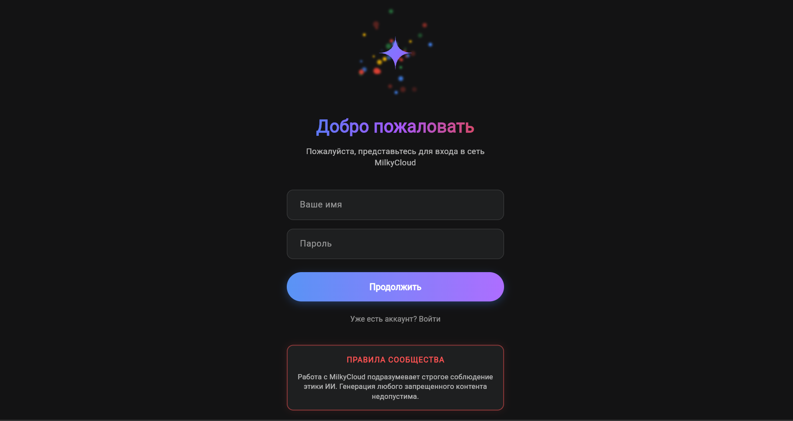

<p align="center"></p>

<h1 align="center">Gemini Bridge</h1>

<p align="center">Self-hosted access point to the Google Gemini API: FastAPI backend with registration by app secret and hardware id, per-user API keys assigned by an admin, Telegram alerts, a Flutter chat client and a desktop admin panel. Docker and nginx.</p>

<p align="center"><a href="https://github.com/milkycloud-dev/gemini-bridge/actions/workflows/release.yml"></a></p>

<p align="center"><a href="#english">English</a> | <a href="#русский">Русский</a></p>

<a id="english"></a>

## English

### What it is

Gemini Bridge sits between a group of users and the Gemini API. Users register in the web client, wait until an admin gives them an API key, and then chat with Gemini through the server, including image and file uploads. The server keeps accounts, chats and request stats in SQLite and tells the admin about new registrations in Telegram. It fits a small team or community that shares keys, or a region where the API is not reachable directly.



### Parts

| Path | Part | Notes |
|---|---|---|
| `server/` | FastAPI backend | `/register`, `/login`, `/chat` with streaming, `/chats`, history, status; SQLite in `DATA_DIR` |
| `web-client/` | Flutter client | chat with Markdown, file upload, dark theme, terms and privacy pages; builds for web and desktop |
| `admin_panel/` | admin app (CustomTkinter) | users, assigning API keys, chat history, IP and account bans |
| `setup.py` | setup script | writes the bot token, chat id, app secret, optional demo key and domain into the configs |
| `docker-compose.yml`, `Dockerfile`, `nginx.conf` | deployment | backend container and nginx with TLS in front of it |

### Access model

- Registration needs the app secret and a hardware id; after that the client works with a server-issued token.
- New users are queued until an admin assigns a Gemini key; the admin gets a Telegram message for each registration and key request.
- The admin can ban an IP or an account.
- Model names in the client map to `gemini-2.5-pro`, `gemini-2.5-flash` and `gemini-2.5-flash-lite`.

### Privacy

The server stores every chat, including uploads, and the admin panel opens them. Tell your users that, and keep the terms and privacy pages of the client in line with how you run it.

### Quick start

```bash
python setup.py                        # bot token, chat id, app secret, domain
docker compose up -d --build           # backend and nginx
cd web-client && flutter build web --release
```

Serve `web-client/build/web` from any static host (the repository publishes it to GitHub Pages on every push to `main`). Put the TLS certificate where `nginx.conf` expects it. The admin panel runs with `python admin_panel/app.py` next to the `data/` folder.

### Releases

A tag `v*` builds the web client and the backend image on GitHub Actions and publishes `gemini-bridge-web.zip` and the source archive with the notes from [CHANGELOG.md](CHANGELOG.md).

### License

Proprietary, all rights reserved. See [LICENSE](LICENSE) for the full terms. Gemini is a trademark of Google LLC; this project is not affiliated with Google.

<a id="русский"></a>

## Русский

### Что это

Gemini Bridge стоит между группой пользователей и API Gemini. Пользователь регистрируется в веб-клиенте, ждёт, пока администратор выдаст ему ключ API, и дальше общается с Gemini через сервер, в том числе с загрузкой картинок и файлов. Сервер хранит аккаунты, чаты и статистику запросов в SQLite и сообщает администратору о новых регистрациях в Telegram. Подходит небольшой команде или сообществу с общими ключами и регионам, где API недоступен напрямую.


### Состав

| Путь | Часть | Примечание |
|---|---|---|
| `server/` | бэкенд на FastAPI | `/register`, `/login`, `/chat` с потоковым ответом, `/chats`, история, статус; SQLite в `DATA_DIR` |
| `web-client/` | клиент на Flutter | чат с Markdown, загрузка файлов, тёмная тема, страницы условий и политики конфиденциальности; сборка для веба и десктопа |
| `admin_panel/` | приложение администратора (CustomTkinter) | пользователи, выдача ключей API, история чатов, баны по IP и аккаунту |
| `setup.py` | скрипт настройки | вписывает токен бота, id чата, app secret, необязательный демо-ключ и домен в конфиги |
| `docker-compose.yml`, `Dockerfile`, `nginx.conf` | развёртывание | контейнер бэкенда и nginx с TLS перед ним |

### Модель доступа

- Для регистрации нужны app secret и hardware id; дальше клиент работает с токеном, который выдаёт сервер.
- Новые пользователи ждут в очереди, пока администратор не назначит ключ Gemini; о каждой регистрации и запросе ключа администратор получает сообщение в Telegram.
- Администратор может забанить IP или аккаунт.
- Названия моделей в клиенте соответствуют `gemini-2.5-pro`, `gemini-2.5-flash` и `gemini-2.5-flash-lite`.

### Конфиденциальность

Сервер хранит все чаты вместе с загрузками, и панель администратора их открывает. Сообщите об этом пользователям и держите страницы условий и политики в клиенте в соответствии с тем, как вы его используете.

### Быстрый старт

```bash
python setup.py                        # токен бота, id чата, app secret, домен
docker compose up -d --build           # бэкенд и nginx
cd web-client && flutter build web --release
```

Папку `web-client/build/web` можно отдавать с любого статического хостинга (репозиторий публикует её на GitHub Pages при каждом пуше в `main`). Сертификат TLS положите туда, где его ждёт `nginx.conf`. Панель администратора запускается командой `python admin_panel/app.py` рядом с папкой `data/`.

### Релизы

Тег `v*` собирает веб-клиент и образ бэкенда в GitHub Actions и публикует `gemini-bridge-web.zip` и архив исходников с описанием из [CHANGELOG.md](CHANGELOG.md).

### Лицензия

Проприетарная, все права защищены. Полные условия в [LICENSE](LICENSE). Gemini это товарный знак Google LLC; проект с Google не связан.
